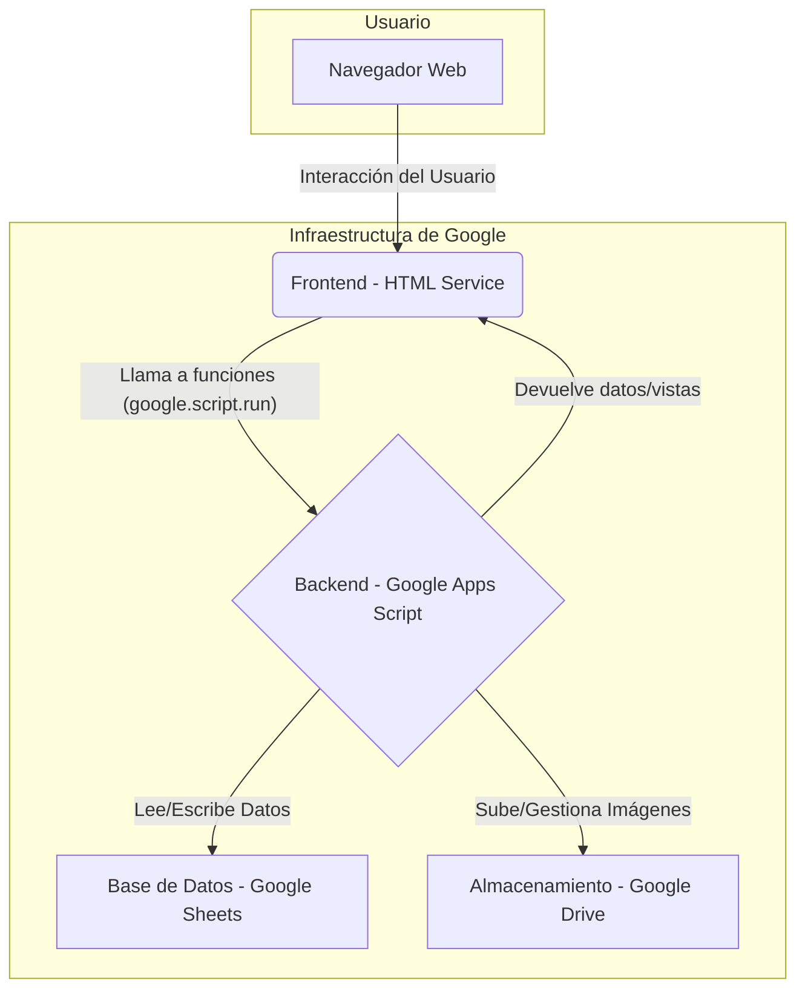
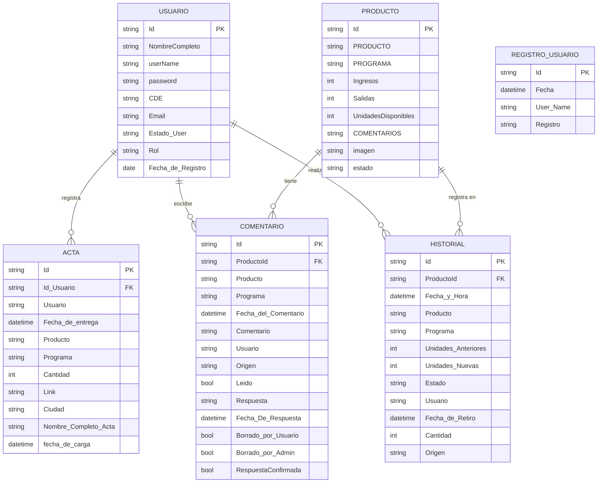

# App Inventario 5.0

Sistema de gestión de inventario diseñado para el control de artículos de papelería, comida y decoración. La aplicación está construida sobre la plataforma de **Google Apps Script**, utilizando **Google Sheets** como base de datos y **Google Drive** para el almacenamiento de imágenes.

## Arquitectura

La aplicación sigue una arquitectura de servidor basada en Google Apps Script, que se encarga de la lógica de negocio y el acceso a los datos, mientras que el frontend se construye con HTML, CSS y JavaScript para la interfaz de usuario.

### Componentes Principales:
*   **Frontend**: Una interfaz de usuario web creada con HTML, CSS y JavaScript. La comunicación con el backend se realiza a través de la función asíncrona `google.script.run`.
*   **Backend (Google Apps Script)**: El núcleo de la aplicación, escrito en JavaScript (versión ES5/ES6). Gestiona las solicitudes del cliente, procesa la lógica de negocio y se comunica con los servicios de Google.
*   **Base de Datos (Google Sheets)**: Se utiliza una o varias hojas de cálculo de Google para almacenar toda la información del inventario, usuarios, historiales y comentarios.
*   **Almacenamiento de Archivos (Google Drive)**: Las imágenes de los productos se suben y se almacenan en una carpeta específica de Google Drive, y la URL de acceso se guarda en Google Sheets.

### Diagrama de Arquitectura



## Modelo de Base de Datos

La base de datos de la aplicación está implementada en **Google Sheets**. Este enfoque, aunque no es una base de datos SQL o NoSQL tradicional, funciona como un sistema de almacenamiento tabular donde cada hoja de cálculo (`Sheet`) actúa como una tabla. Las relaciones entre las tablas no se definen con claves foráneas (`foreign keys`) explícitas, sino de manera implícita a través de la lógica de la aplicación, principalmente uniendo datos por columnas de `Id`.

A continuación, se presenta un diagrama de Entidad-Relación (ERD) que modela las principales "tablas" (hojas) y sus relaciones, inferido a partir del código fuente del backend.



### Descripción de las Entidades

*   **USUARIO**: Almacena la información de los usuarios que pueden acceder al sistema, incluyendo sus credenciales y roles.
*   **PRODUCTO**: Representa una tabla genérica para los artículos del inventario (Papelería, Comida, Decoración). Contiene información sobre el stock, nombre y estado.
*   **ACTA**: Guarda un registro de las actas generadas, incluyendo un enlace al PDF almacenado en Google Drive y el usuario que la generó.
*   **COMENTARIO**: Centraliza todos los comentarios realizados sobre los productos, con su estado y las respuestas correspondientes.
*   **HISTORIAL**: Registra todos los movimientos y cambios que ocurren en el inventario, sirviendo como una bitácora de auditoría.
*   **REGISTRO_USUARIO**: Lleva un registro de los inicios de sesión de los usuarios en el sistema.

**Nota**: Las hojas `Inventario`, `Comida`, `Decoracion` y `Papeleria` comparten una estructura similar, que ha sido consolidada en la entidad `PRODUCTO` en este diagrama para simplificar.

## Flujo de Trabajo

El flujo de trabajo general de la aplicación se centra en la interacción del usuario con la interfaz web, que a su vez desencadena funciones en el backend para manipular los datos.

1.  **Autenticación**: El usuario ingresa sus credenciales en la página de `Login.html`. El frontend envía estos datos al backend (`Controller/Login.js` y `Service/Autenticacion.js`), que los verifica contra la hoja de usuarios en Google Sheets.
2.  **Visualización de Datos**: Una vez autenticado, el usuario navega por los diferentes módulos (Papelería, Comida, etc.). El frontend solicita los datos del módulo correspondiente al backend.
3.  **Lógica de Backend**: El backend (`utilis/CrudRead.js`) consulta la hoja de cálculo de Google Sheets para obtener los productos.
4.  **Renderizado en Frontend**: Los datos se devuelven al frontend, donde JavaScript (`Js/Js_Articulos.html`, etc.) se encarga de renderizar dinámicamente las tablas y la información en la vista (`Page/Articulos.html`, etc.).
5.  **Operaciones CRUD**: Al agregar, actualizar o eliminar un producto, el frontend captura la información del formulario y la envía al backend (`utilis/CrudWrite.js`, `desactivarProducts.js`), que realiza la operación correspondiente en Google Sheets.
6.  **Subida de Imágenes**: Cuando se agrega un producto con imagen, el frontend envía el archivo al backend (`utilis/SubirImagen.js`), que lo procesa y lo guarda en una carpeta de Google Drive, almacenando el ID del archivo en la hoja de cálculo.

## Estructura del Proyecto

El proyecto está organizado en dos carpetas principales: `BackEnd` y `View`.

```
.
├── BackEnd/
│   ├── Controller/  # Maneja las solicitudes del cliente y la lógica de navegación.
│   ├── Model/       # Define la estructura de los objetos de datos (Producto, Usuario, etc.).
│   ├── Service/     # Contiene la lógica de negocio y la comunicación con servicios externos (Google Drive/Sheets).
│   └── utilis/      # Funciones de utilidad reutilizables (CRUD, subida de imágenes, etc.).
└── View/
    ├── Css/         # Archivos .html que contienen los estilos CSS.
    ├── Js/          # Archivos .html que contienen la lógica JavaScript del cliente.
    ├── Page/        # Plantillas HTML para las diferentes páginas de la aplicación.
    └── *.html       # Archivos principales como Index.html y Login.html.
```

## Requerimientos Funcionales

A continuación se detallan las funcionalidades de la aplicación para los roles de Usuario y Administrador.

### Funcionalidades del Usuario
- **RF01**: Iniciar sesión con nombre de usuario y contraseña.
- **RF02**: Navegar por las categorías: Papelería, Comida, Decoración, Inventario General.
- **RF03**: Registrar nuevos productos en los módulos correspondientes.
- **RF04**: Actualizar la cantidad de productos existentes.
- **RF05**: Visualizar el tiempo que un producto lleva en stock.
- **RF06**: Buscar productos por nombre en cada módulo.
- **RF07**: Identificar visualmente productos agotados.
- **RF08**: Consultar las unidades disponibles de cada producto.
- **RF09**: Recibir notificaciones de productos agotados o próximos a vencer.
- **RF10**: Recuperar contraseña a través del correo electrónico.
- **RF11**: Registrar el retiro de productos del inventario.
- **RF13**: Ordenar productos por fecha de ingreso (más reciente a más antiguo).
- **RF14**: Realizar comentarios sobre productos para informar novedades.
- **RF15**: Cerrar sesión de forma segura.

### Funcionalidades del Administrador
- **RF01**: Iniciar sesión con credenciales de administrador.
- **RF02**: Realizar configuraciones generales en la plataforma.
- **RF03**: Gestionar usuarios (agregar, actualizar, eliminar).
- **RF04**: Realizar operaciones CRUD completas sobre los productos.
- **RF05**: Eliminar productos del inventario (dar de baja).
- **RF06**: Acceder a un Dashboard con análisis y reportes visuales del inventario.
- **RF07**: Visualizar el historial de ingresos de los usuarios.
- **RF08**: Deshabilitar u ocultar artículos sin disponibilidad.
- **RF09**: Ingresar y modificar el precio de los artículos.
- **RF10**: Utilizar filtros avanzados para optimizar la búsqueda de artículos.
- **RF11**: Visualizar un historial de todos los movimientos realizados en el inventario.
- **RF12**: Revisar los comentarios dejados por los usuarios.
- **RF13**: Recibir notificaciones sobre productos con pocas unidades o próximos a vencer.
- **RF14**: Cerrar sesión de forma segura.

## Requerimientos No Funcionales
- **RNF01 (Rendimiento)**: Tiempos de respuesta rápidos en consultas y actualizaciones.
- **RNF02 (Multi-usuario)**: Capacidad para manejar múltiples usuarios simultáneos.
- **RNF03 (Usabilidad)**: Interfaz de usuario intuitiva, accesible y fácil de usar.
- **RNF04 (Mantenimiento)**: Código escalable y fácil de mantener.
- **RNF05 (Actualización)**: Facilidad para integrar nuevas funcionalidades.
- **RNF06 (Disponibilidad)**: Alta disponibilidad de la aplicación.
- **RNF07 (Seguridad)**: Protección de los datos de sesión y de la información sensible.

## Tecnologías Utilizadas
- **Plataforma**: Google Apps Script
- **Lenguajes**: JavaScript, HTML, CSS
- **Base de Datos**: Google Sheets
- **Almacenamiento**: Google Drive
- **Despliegue**: Publicado como Aplicación Web desde el editor de Google Apps Script.
- **CLI (Opcional)**: Google Clasp para desarrollo local.
